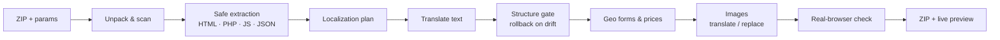
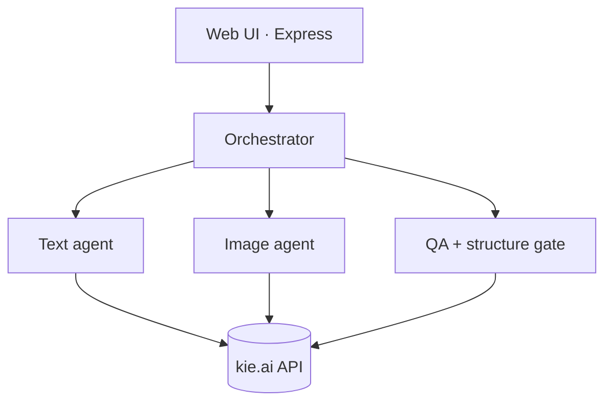

<div align="center">

# 🌍 Perevod — AI Landing-Page Localizer

**Drop in a landing-page ZIP → get it back fully localized for another GEO & offer.**
Text, prices, forms and images are adapted — the layout stays intact.

[](#-quick-start)
[](package.json)
[](LICENSE)
[](https://kie.ai?ref=f5a044e67d35962c997eed6db4e5aa75)

**English** · [Русский](README.ru.md)


</div>

---

## ✨ What it does

You upload a ZIP of a landing page and a few parameters (country, language, currency, offer name, prices, discount). Perevod returns a ready-to-launch ZIP **and** a live preview:

- 🗣 **Human translation & localization** — not word-for-word: cities, reviewer names, phone codes and the whole tone are adapted to the target GEO.
- 🏷 **Offer swap** — the old product/brand is replaced by your offer name everywhere: body text, form fields, `<meta>` and even on images.
- 💰 **Prices & discounts** — updated in text, in forms and inside JS promo logic (spinners, "pick a door", timers). Free-mode (0 / 100 %) is handled without "free + discount" contradictions.
- 🖼 **Images** — text banners are re-drawn in the target language; product shots can be replaced with your own offer photos; real review/lifestyle photos are edited (the new package composited in) so the page stays alive.
- 🧱 **Never breaks the layout** — the DOM skeleton is diffed before/after; any edit that would change the structure is rolled back automatically.
- 🌐 **Writing systems** — pick Cyrillic / Latin / Arabic for languages that use several (Uzbek, Kazakh, Serbian…).
- 🧠 **Self-improving** — the orchestrator keeps a growing list of "house rules" learned from past jobs.
- ✅ **Real-browser check** — the result is rendered in a headless browser and compared to the original (funnel depth, forms, new JS errors).

> It never touches your backend: `api.php`, `error.php`, `success.php` and the `success/` `error/` dictionary folders are left exactly as they are.

## 🧩 How it works



Text is never handed to a model as "rewrite this file". A safe extractor pulls out **only** human-readable strings — `parse5` for HTML, PHP's own tokenizer (`token_get_all`) to separate inline-HTML from PHP code, `acorn` for JS string literals, JSON string values — translates those, and stitches them back byte-for-byte. That is why the markup, styles and scripts survive.



## 🚀 Quick start

Any Linux server with **Docker** installed. One command set:

```bash
git clone https://github.com/Leontev-E/perevod.git
cd perevod
./install.sh
```

The installer:

1. checks Docker & Compose,
2. creates `.env` with a **random password & session secret**,
3. builds the image (Node + Chromium) and starts the container,
4. prints your URL and login password.

Then open the app → log in → **⚙ Settings** → paste your **kie.ai API key** (get one at [kie.ai → API Keys](https://kie.ai?ref=f5a044e67d35962c997eed6db4e5aa75)). The key is stored on a persistent volume and survives rebuilds.

Update later with:

```bash
./update.sh
```

<details>
<summary>Don't have Docker yet?</summary>

```bash
curl -fsSL https://get.docker.com | sh
```
</details>

## ⚙️ Configuration

Everything lives in `.env` (created from [`.env.example`](.env.example)). No secrets are stored in the code or the image.

| Variable | Default | Description |
|---|---|---|
| `APP_PASSWORD` | *(random)* | Password for the web UI |
| `SESSION_SECRET` | *(random)* | Signs the session cookie |
| `WEB_PORT` | `8070` | Host port — `http://SERVER_IP:8070` |
| `PUBLIC_BASE_URL` | `http://localhost:8070` | Public URL for download/preview links |
| `MAX_IMAGES` | `60` | Max image edits per job |
| `MAX_UPLOAD_MB` | `80` | Max upload size |

The **kie.ai key is set in the UI**, not here — it is saved to `/data/settings.json` on the Docker volume.

> 🔒 **Production tip:** the app has a password gate but ships over plain HTTP on `WEB_PORT`. Put it behind a reverse proxy (Nginx / Caddy / Apache) with HTTPS and point `PUBLIC_BASE_URL` at your domain.

## 🖼 Screenshots

| Upload & parameters | Settings (API key) | Login |
|---|---|---|
|  |  |  |

## 🛠 Tech stack

Node.js 20 · Express · Docker · headless Chromium (`puppeteer-core`) · `parse5` · `acorn` + `magic-string` · `sharp` · php-cli (tokenizer only) · multi-agent via **[kie.ai](https://kie.ai?ref=f5a044e67d35962c997eed6db4e5aa75)** (GPT-5.5 orchestrator · Claude Sonnet 5 text · GPT Image 2 images).

## 📇 Contacts

- 📣 **Developer channel — BoostClicks (Евгений Леонтьев):** https://t.me/boostclicks
- 🛡 **Google cloaker — BoostRouter:** https://klo-boostclicks.online
- 🌐 **Traffic arbitrage:** https://boostclicks.ru

## 📄 License

[MIT](LICENSE) © BoostClicks — Евгений Леонтьев
