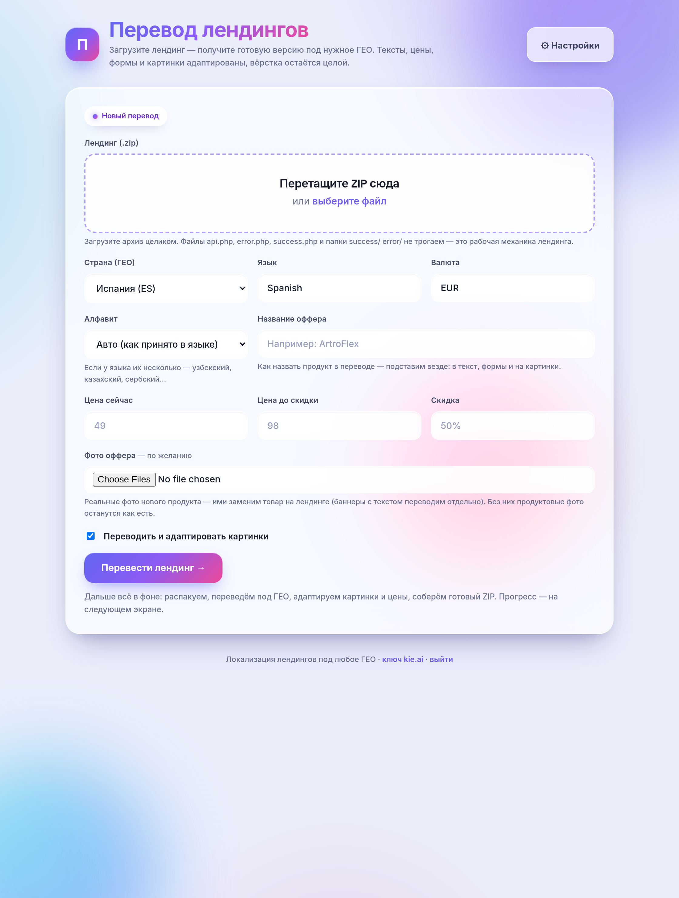
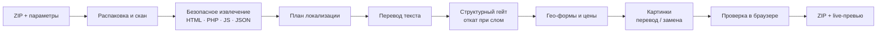
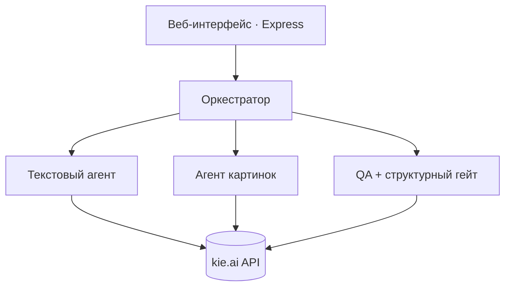
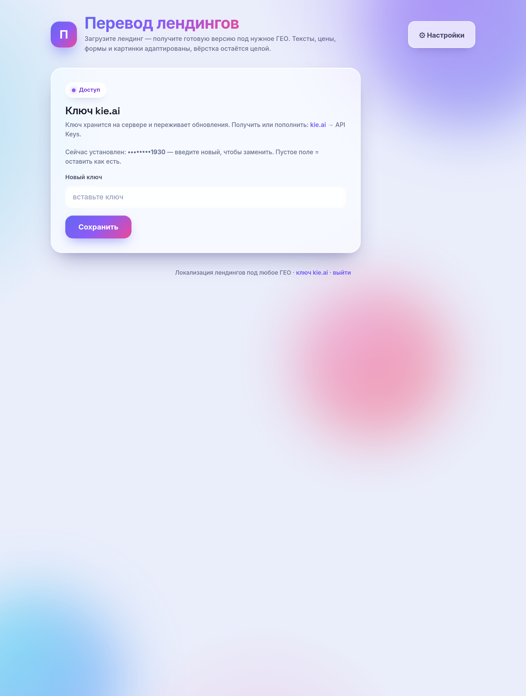

<div align="center">

# 🌍 Perevod — ИИ-локализатор лендингов

**Загружаешь ZIP лендинга → получаешь его полностью переведённым под другое ГЕО и оффер.**
Текст, цены, формы и картинки адаптируются — вёрстка остаётся целой.

[](#-быстрый-старт)
[](package.json)
[](LICENSE)
[](https://kie.ai?ref=f5a044e67d35962c997eed6db4e5aa75)

[English](README.md) · **Русский**



</div>

---

## ✨ Что делает

Загружаешь ZIP лендинга и несколько параметров (страна, язык, валюта, название оффера, цены, скидка). На выходе — готовый ZIP **и** live-превью:

- **Человеческий перевод и локализация** — не пословно: города, имена в отзывах, телефонные коды и вся тональность подгоняются под целевое ГЕО.
- **Подмена оффера** — старый продукт/бренд заменяется твоим названием оффера везде: в тексте, полях формы, `<meta>` и даже на картинках.
- **Цены и скидки** — обновляются в тексте, в формах и внутри JS-промо (спиннеры, «выбери дверь», таймеры). Free-режим (0 / 100 %) обрабатывается без противоречия «бесплатно + скидка».
- **Картинки** — текстовые баннеры перерисовываются на целевом языке; продуктовые фото можно заменить твоими фото оффера; живые фото из отзывов правятся (упаковка нового оффера вписывается в реальную сцену), чтобы страница оставалась «живой».
- **Не ломает вёрстку** — скелет DOM сверяется до/после; любая правка, меняющая структуру, автоматически откатывается.
- **Письменность** — Кириллица / Латиница / Арабская для языков с несколькими алфавитами (узбекский, казахский, сербский…).
- **Самообучение** — оркестратор копит список «правил дома», выученных на прошлых задачах.
- **Проверка в настоящем браузере** — результат рендерится headless-браузером и сверяется с оригиналом (глубина воронки, формы, новые JS-ошибки).

> Бэкенд не трогается: `api.php`, `error.php`, `success.php` и папки-словари `success/` `error/` остаются как есть.

## 🧩 Как это работает



Файлы никогда не отдаются модели как «перепиши это». Безопасный экстрактор достаёт **только** человекочитаемые строки — `parse5` для HTML, родной PHP-токенизатор (`token_get_all`) отделяет inline-HTML от PHP-кода, `acorn` — строки в JS, строковые значения JSON — переводит их и склеивает обратно байт-в-байт. Поэтому разметка, стили и скрипты выживают.



## 🚀 Быстрый старт

Любой Linux-сервер с установленным **Docker**. Один набор команд:

```bash
git clone https://github.com/Leontev-E/perevod.git
cd perevod
./install.sh
```

Установщик:

1. проверяет Docker и Compose,
2. создаёт `.env` со **случайным паролем и session-секретом**,
3. собирает образ (Node + Chromium) и запускает контейнер,
4. печатает адрес и пароль для входа.

Дальше — открой приложение → войди → **⚙ Настройки** → вставь свой **ключ kie.ai** (взять на [kie.ai → API Keys](https://kie.ai?ref=f5a044e67d35962c997eed6db4e5aa75)). Ключ хранится на постоянном томе и переживает пересборки.

Обновление позже:

```bash
./update.sh
```

<details>
<summary>Docker ещё не установлен?</summary>

```bash
curl -fsSL https://get.docker.com | sh
```
</details>

## ⚙️ Конфигурация

Всё в `.env` (создаётся из [`.env.example`](.env.example)). Секретов в коде и образе нет.

| Переменная | По умолчанию | Описание |
|---|---|---|
| `APP_PASSWORD` | *(случайный)* | Пароль для веб-интерфейса |
| `SESSION_SECRET` | *(случайный)* | Подпись cookie сессии |
| `WEB_PORT` | `8070` | Порт хоста — `http://SERVER_IP:8070` |
| `PUBLIC_BASE_URL` | `http://localhost:8070` | Публичный URL для ссылок скачивания/превью |
| `MAX_IMAGES` | `60` | Лимит правок картинок на задачу |
| `MAX_UPLOAD_MB` | `80` | Максимальный размер загрузки |

**Ключ kie.ai задаётся в интерфейсе**, а не здесь — он сохраняется в `/data/settings.json` на Docker-томе.

> 🔒 **Для продакшена:** у приложения есть парольный вход, но оно отдаётся по обычному HTTP на `WEB_PORT`. Поставь его за reverse-proxy (Nginx / Caddy / Apache) с HTTPS и укажи `PUBLIC_BASE_URL` на свой домен.

## 🖼 Скриншоты

| Загрузка и параметры | Настройки (API-ключ) | Вход |
|---|---|---|
|  |  |  |

## 🛠 Стек

Node.js 20 · Express · Docker · headless Chromium (`puppeteer-core`) · `parse5` · `acorn` + `magic-string` · `sharp` · php-cli (только токенизатор) · мультиагент через **[kie.ai](https://kie.ai?ref=f5a044e67d35962c997eed6db4e5aa75)** (оркестратор GPT-5.5 · тексты Claude Sonnet 5 · картинки GPT Image 2).

## 📇 Контакты

- 📣 **Канал разработчика — BoostClicks (Евгений Леонтьев):** https://t.me/boostclicks
- 🛡 **Клоака для Гугла — BoostRouter:** https://klo-boostclicks.online
- 🌐 **Сайт по арбитражу трафика:** https://boostclicks.ru

## 📄 Лицензия

[MIT](LICENSE) © BoostClicks — Евгений Леонтьев
